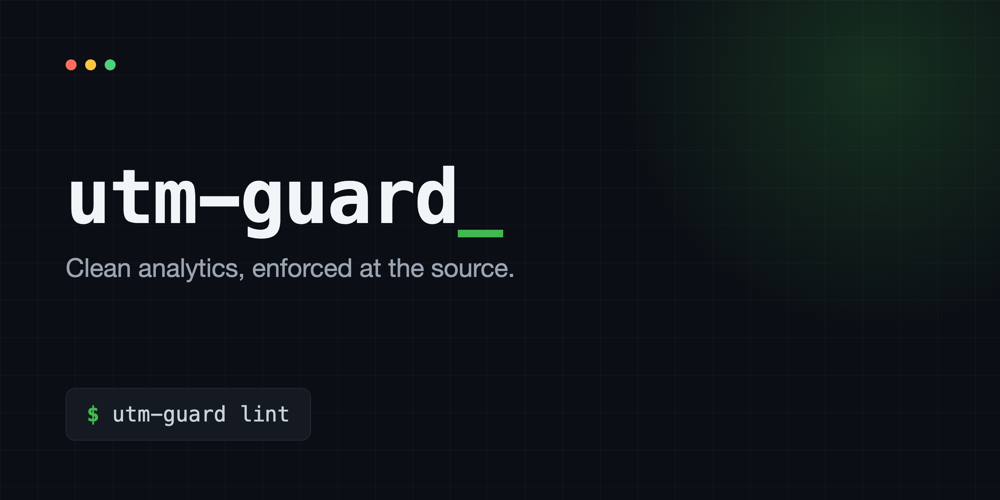

<p align="center">
  
</p>

<p align="center">
  
  
  
  
  
</p>

# utm-guard

Build UTM-tagged URLs from a controlled vocabulary that refuses unknown values, and lint your files for links that forgot their tags. Clean analytics, enforced at the source.

## The Problem

To know where your visitors come from, you tag your links. A UTM tag is just text bolted onto a URL: `?utm_source=linkedin`. The trouble is that it is *just text*, and text drifts.

One person writes `linkedin`, another writes `LinkedIn`, a third writes `li`. Your analytics treats those as three different sources, and your traffic picture splinters into pieces that should have been one. Worse, when someone forgets the tag entirely, that visit shows up as **direct**, as if the person arrived from nowhere. So the truth about where your audience comes from quietly rots, one inconsistent or missing tag at a time.

Here is what that costs. On a site I run, an attribution audit found that about 70 percent of our "direct" traffic was not direct at all. It was shared links that had gone out untagged. We had been flying blind on most of our reach without knowing it.

The fix is one idea: **write your allowed values down once, then enforce them.** When you build a link, refuse any source, medium, or campaign that is not on the list, so `linkedin` can never quietly become `LinkedIn`. And scan your files for links that forgot their tags, so a missing tag fails a check instead of silently becoming "direct."

## What it does

Two commands around one vocabulary:

- **`build`** makes a tagged URL, and refuses any value that is not in your vocabulary.
- **`lint`** scans your files for outbound links to your domain that are missing their tag or carry a value outside your vocabulary.

## Demo

```text
$ utm-guard build /guides/arc-registration --source linkedin --medium social --campaign launch
https://example.com/guides/arc-registration?utm_source=linkedin&utm_medium=social&utm_campaign=launch

$ utm-guard build /guides/arc-registration --source LinkedIn --medium social
utm-guard: refused.
  --source "LinkedIn" is not in the vocabulary. Allowed: newsletter, linkedin, x, facebook, instagram, youtube, reddit

$ utm-guard lint
utm-guard: FAIL. 1 example.com link issue(s) across 1 file(s).

  examples/content/bad-post.md:7  missing utm_source: https://example.com/guides/how-jeonse-works
```

The second command is refused because the vocabulary only allows lowercase `linkedin`. That refusal is the whole point: the bad value never makes it into a real link.

## Quick Start

See it work:

```bash
git clone https://github.com/hwajongpark/utm-guard
cd utm-guard
npm run demo:build    # prints a tagged URL
npm run demo:refuse   # shows a refusal
npm run demo:lint     # catches an untagged link
```

Use it on your own project:

```bash
npm install --save-dev utm-guard

# copy the example vocabulary and edit it
cp node_modules/utm-guard/examples/utm.vocab.example.json ./utm.vocab.json

# build a tagged link
npx utm-guard build /guides/arc --source linkedin --medium social --campaign launch

# check that nothing shipped untagged
npx utm-guard lint
```

Wire the lint into your build so an untagged link fails the deploy:

```json
{
  "scripts": {
    "prebuild": "utm-guard lint"
  }
}
```

## Configuration

One `utm.vocab.json` at your project root. The included [`examples/utm.vocab.example.json`](examples/utm.vocab.example.json) is the demo vocabulary.

```json
{
  "baseUrl": "https://example.com",
  "sources": ["newsletter", "linkedin", "x", "facebook", "instagram", "youtube", "reddit"],
  "mediums": ["social", "email", "referral"],
  "campaigns": ["launch", "weekly", "evergreen"],
  "lint": {
    "scanDirs": ["content"],
    "extensions": [".md", ".mdx", ".html", ".txt"],
    "urlHost": "example.com",
    "requireParam": "utm_source"
  }
}
```

- **`baseUrl`**: lets `build` tag a relative path like `/guides/arc`.
- **`sources`, `mediums`, `campaigns`**: your allowed values. `build` refuses anything not listed. `source` and `medium` are required; `campaign` is optional.
- **`lint`**: where to scan, which file types, the domain whose outbound links must be tagged, and the param they must carry. If a link already has `utm_source`, `utm_medium`, or `utm_campaign`, the value must be in the vocabulary.

## How It Works

**One vocabulary, two jobs.** The same list of allowed values powers both generating links and auditing them. There is a single source of truth, not one rule for writing and another for checking.

**It enforces at generation time, not audit time.** The cheapest moment to stop a bad tag is before the bad URL exists. `build` refuses `LinkedIn` up front, so you never have to hunt it down in analytics three weeks later.

**No dependencies.** It is plain Node: it builds URL strings with the standard library and scans files with the standard library. Nothing to audit but the one file.

**Exit codes are built for CI.** `0` clean, `1` something was refused or untagged, `2` a config or usage error. Drop `utm-guard lint` in `prebuild` and an untagged link fails the deploy, not your analytics.

## What It Does Not Do

- It does not talk to Google Analytics or any provider. It governs the links you create and ship, which is the part you control.
- It does not rewrite existing links. `lint` reports them with file and line; you fix them.
- It does not check that the destination resolves. It checks that the tag is present and that known UTM values are from your vocabulary.

## Contributing

Contributions are welcome. Bug reports, a `lint` false positive, an untagged link it missed, or an idea for a new check all help. The fastest way to land a fix is a failing example under [`examples/content/`](examples/content) plus the result you expected.

## License

[MIT](LICENSE)
